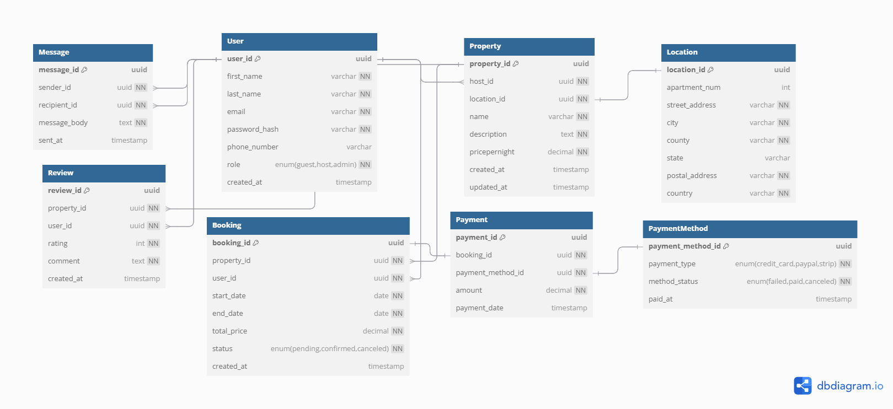

# Normalization Design and Diagram

To conform the database to the 3rd Normal Form (3NF), the ERD is design with the following changes:

## Location
- `Location table` was added to avoid transitive dependency with possible fields like `street_address`, `city`, `country` that depends on location rather than the property_id
- Added a `location_id` as a foreign key to property table for a `one-to-one relationship`

## PaymentMethod
- `PaymentMethod table` was added for future purpose, if there is need to add a new payment method
- Included `payment method status` as `enum` with values like `paid`, `failed`, `canceled` for different method status on each stage of property booking